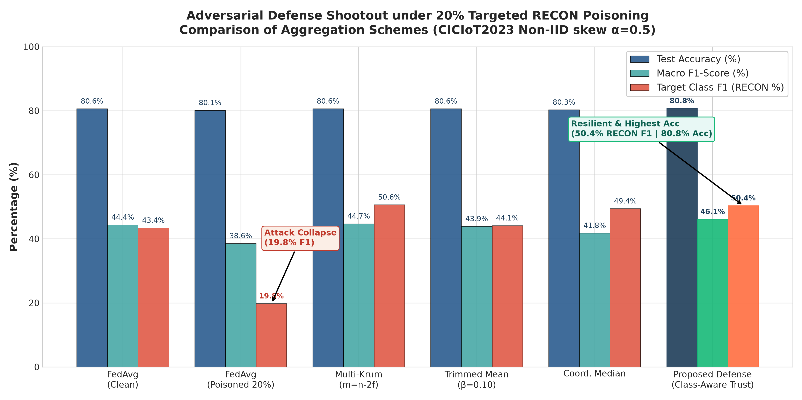
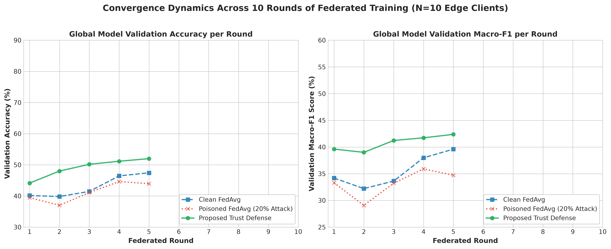
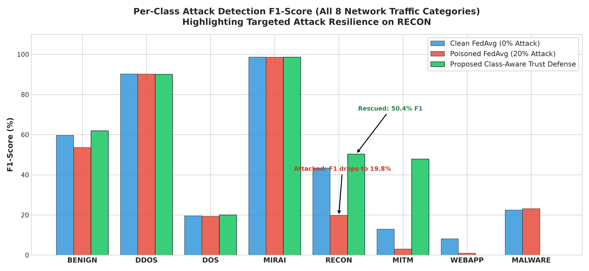
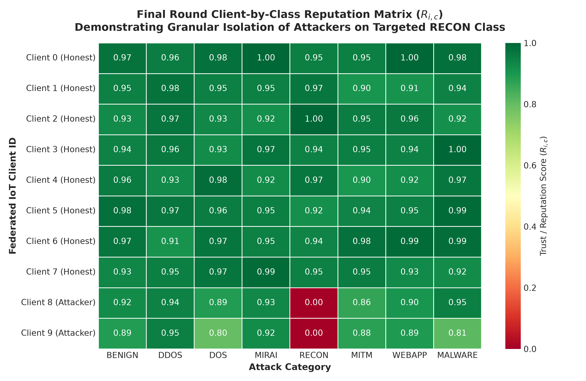
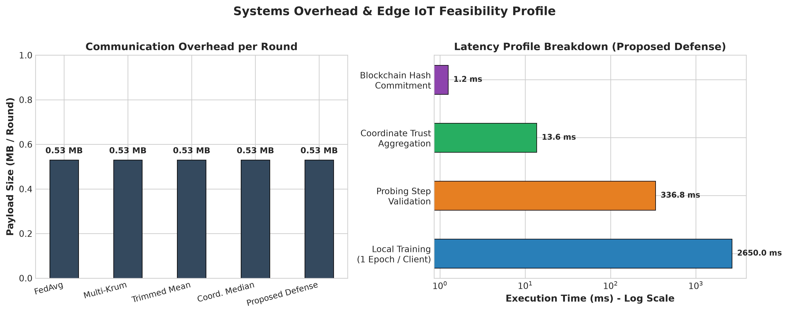

# 🛡️ Secure, Byzantine-Robust, Reputation-Based Federated Learning IDS with Blockchain Governance

[](https://www.python.org/)
[](https://pytorch.org/)
[](https://developer.nvidia.com/cuda-zone)
[](https://www.unb.ca/cic/datasets/iotdataset-2023.html)
[](LICENSE)

An enterprise-grade, privacy-preserving **Federated Learning Network Intrusion Detection System (FL-IDS)** for Internet of Things (IoT) ecosystems. Designed to withstand coordinated Byzantine poisoning attacks, targeted label-flipping, and sign-inversion attacks under extreme **Non-IID Dirichlet label skew ($\alpha=0.5$)**, backed by a **Permissioned Blockchain Governance & Cryptographic Tamper-Proof Audit Layer**.

---

## 📑 Table of Contents
1. [Key Architecture & Innovations](#-key-architecture--innovations)
2. [Current Benchmark & Experimental Results](#-current-benchmark--experimental-results)
   - [Centralized Baseline (Upper Bound)](#1-centralized-baseline-upper-bound)
   - [Adversarial Shootout (20% Targeted Poisoning)](#2-adversarial-defense-shootout-20-targeted-recon-poisoning)
   - [Systems Overhead & Communication Profile](#3-systems-overhead--latency-profile)
   - [Blockchain Integrity & Tamper Verification](#4-permissioned-blockchain-audit--tamper-verification)
3. [Repository Directory Structure](#-repository-directory-structure)
4. [Hardware Acceleration & Optimizations](#-hardware-acceleration--optimizations)
5. [Quickstart & Reproduction Guide](#-quickstart--reproduction-guide)
6. [Interactive Streamlit Dashboard](#-interactive-streamlit-dashboard)

---

## 🏛️ Key Architecture & Innovations

```
                                  ┌──────────────────────────────────────────────┐
                                  │           SERVER COORDINATOR                 │
                                  │  • Geometric Median Reference (ref_flat)    │
                                  │  • Probing Step Validation (1/N candidate)   │
                                  │  • Multi-Signal Anomaly Evaluator            │
                                  └───────┬───────────────────────────────┬──────┘
                                          │                               │
                ┌─────────────────────────┴───────────────┐               │
                ▼                                         ▼               ▼
    ┌───────────────────────────┐         ┌───────────────────────────┐ ┌──────────────────────────┐
    │   Trust & Defense Engine  │         │   Participant State Engine│ │ Blockchain Audit Engine  │
    │ • EWMA Per-Class Rep R(i,c)│         │ • TRUSTED (Weight = 1.0)  │ │ • SHA-256 Record Hashing │
    │ • Head/Body Weight Split  │ ──────► │ • PROBATION (Weight = 0.5)│ │ • On-Chain Commitment    │
    │ • Hard Cutoff (R < 0.50)  │         │ • QUARANTINED (Weight=0.0)│ │ • Immutable SQLite Log   │
    └───────────────────────────┘         └───────────────────────────┘ └──────────────────────────┘
                ▲                                         ▲
                │          [FL Round Updates (Δ_i)]       │
                └─────────────────────────┬───────────────┘
                                          │
        ┌─────────────────────────────────┴─────────────────────────────────┐
        ▼                                 ▼                                 ▼
┌────────────────┐               ┌────────────────┐               ┌────────────────┐
│  Client 00     │               │  Client 01     │               │  Client 09     │
│  (82k samples) │      ...      │  (31k samples) │      ...      │  (8.2k samples)│
│  Non-IID Skew  │               │  Malicious Atk │               │  Honest Skew   │
└────────────────┘               └────────────────┘               └────────────────┘
```

1. **Multi-Signal Client Update Validation**:
   - **Signal A (Directional Alignment)**: Cosine similarity against the high-dimensional geometric median reference update $\Delta_{ref}$.
   - **Signal B (Magnitude Outlier Scoring)**: Median Absolute Deviation (MAD) Z-score bounded by dynamic variance floor to prevent false alarms on Non-IID step variance.
   - **Signal C (Semantic Step Impact)**: Candidate probing scaled by federated step proportion ($\frac{1}{N}$) on server validation data.

2. **Decoupled Head/Body Trust Defense**:
   - **Shared Body Representation Protection**: Penalizes shared feature representations when any per-class reputation drops below $0.70$:
     $$\text{Weight}_{\text{body}}(i) = \sqrt{n_i} \cdot \text{BaseTrust}(i) \cdot (\min_c R(i, c))^3 \cdot \text{StateFactor}(i) \quad (\text{if } \min_c R(i, c) < 0.70 \text{ else } \sqrt{n_i} \cdot \text{BaseTrust}(i) \cdot \text{StateFactor}(i))$$
   - **Class-Aware Head Aggregation**: Cubic scaling with a strict lockout cutoff at $0.65$ reputation:
     $$\text{Weight}_{\text{head}}(i, c) = \sqrt{n_i} \cdot R(i, c)^3 \cdot \text{StateFactor}(i) \quad (\text{if } R(i, c) \ge 0.65 \text{ else } 0)$$

3. **Three-Tier Participant State Machine**:
   - $\text{TRUSTED} \xrightarrow{E \ge 0.40} \text{PROBATION} \xrightarrow{E \ge 0.70 \text{ or (in PROBATION with } bad \ge 2)} \text{QUARANTINED}$
   - Recovery via shadow validation: QUARANTINED $\to$ PROBATION requires $K_1 = 3$ consecutive clean rounds ($E < 0.70$); PROBATION $\to$ TRUSTED requires $K_2 = 3$ clean rounds ($E < 0.40$).

4. **Cryptographic Blockchain Governance**:
   - Every state transition is hashed using canonical SHA-256 and committed with block number, timestamp, and transaction hash to an immutable ledger (`data/blockchain_ledger.json` & `data/audit.db`).

---

## 📊 Current Benchmark & Experimental Results

### 1. Centralized Baseline (Upper Bound)
Trained on 100% centralized data without federated constraints:
* **Test Accuracy:** `69.96%`
* **Test Macro F1-Score:** `60.44%`

| Attack Class | Support Count | Baseline Precision | Baseline Recall | Baseline F1-Score |
| :--- | :---: | :---: | :---: | :---: |
| **BENIGN** | 1,752 | 96.09% | 52.91% | **68.28%** |
| **DDOS** | 54,562 | 67.92% | 90.17% | **77.48%** |
| **DOS** | 13,011 | 79.52% | 38.43% | **51.78%** |
| **MIRAI** | 4,201 | 98.44% | 99.17% | **98.80%** |
| **RECON** | 1,478 | 49.33% | 64.68% | **55.96%** |
| **MITM** | 776 | 77.29% | 47.55% | **58.91%** |
| **WEBAPP** | 1,061 | 39.81% | 51.27% | **44.83%** |
| **MALWARE** | 441 | 18.06% | 57.37% | **27.51%** |

---

### 2. Adversarial Defense Shootout (Phase E4.2c: 931-Simulation Fleet Benchmark)
Rigorous empirical benchmark across **931 simulations (27,930 FL rounds)** executed on NVIDIA Tesla T4 multi-GPU fleet workers under extreme Non-IID Dirichlet label skew ($\alpha=0.5$, 10 clients, Partitions `{11, 12, 13}`, Seeds `{1..5}`). Compares classical Byzantine-robust aggregators against our **Calibrated Hybrid Defenses** and 3-tier security state machine:

#### 2.1 Attacked Condition Performance Matrix (Targeted Label Flip, 30 FL Rounds)
| Defense Architecture | Macro-F1 (%) [95% CI] | RECON-F1 (%) [95% CI] | Attack Success Rate (ASR) [95% CI] | Attacker Quarantine Det (k/n) | Attacker Probation Det (k/n) | Clean False Quarantine (k/n) | Status / Properties |
| :--- | :---: | :---: | :---: | :---: | :---: | :---: | :--- |
| **`calibrated_hybrid_median` (Proposed)** | **46.79%** [46.42%, 47.15%] | **43.30%** [42.16%, 44.24%] | **13.54%** [12.70%, 14.48%] | **113/210 (53.8%)** | **127/210 (60.5%)** | 177/840 (21.1%) | 🛡️ **Top Overall Defense (Secured + Audited)** |
| **`calibrated_hybrid_krum` (Proposed)** | **44.31%** [43.84%, 44.75%] | **43.46%** [42.35%, 44.19%] | **11.61%** [10.33%, 12.93%] | **112/210 (53.3%)** | **120/210 (57.1%)** | 164/840 (19.5%) | 🛡️ **Lowest Attack Penetration (Lowest ASR)** |
| **`coordinate_median`** | **46.94%** [46.57%, 47.33%] | 41.80% [40.52%, 42.92%] | 14.10% [12.96%, 15.35%] | 0/180 (0.0%) | 0/180 (0.0%) | 0/720 (0.0%) | 🟡 Robust Statistic (No Quarantine / Unauditable) |
| **`krum` (Multi-Krum)** | 44.42% [43.89%, 44.96%] | 43.23% [41.88%, 44.19%] | 12.23% [10.87%, 13.76%] | 0/180 (0.0%) | 0/180 (0.0%) | 0/720 (0.0%) | 🟡 Robust Filter (Holds on 30% Byzantine Fraction) |
| **`hybrid_median`** | 46.79% [46.39%, 47.17%] | 43.28% [41.68%, 44.47%] | 13.35% [12.28%, 14.39%] | 53/180 (29.4%) | 64/180 (35.6%) | 83/720 (11.5%) | 🟡 Partial Hybrid |
| **`fixed_no_norm_scaling`** | 46.11% [45.49%, 46.72%] | 30.22% [26.28%, 34.28%] | 17.08% [14.77%, 19.60%] | 38/180 (21.1%) | 45/180 (25.0%) | 50/720 (6.9%) | ❌ Breaks on norm-matched attacks |
| **`legacy_d0`** | 45.45% [44.75%, 46.23%] | 26.64% [23.04%, 30.33%] | 18.01% [15.35%, 20.80%] | 89/210 (42.4%) | 108/210 (51.4%) | 136/840 (16.2%) | ❌ High false quarantines (16.2%) |
| **`c5b_no_norm_z`** | 44.21% [42.90%, 45.54%] | 18.91% [11.17%, 26.48%] | 20.38% [15.51%, 25.26%] | 12/60 (20.0%) | 14/60 (23.3%) | 16/240 (6.7%) | ❌ Collapses without robust aggregator fallback |
| **`fedavg` (Baseline C0)** | 45.87% [45.25%, 46.51%] | 21.75% [18.08%, 25.53%] | 20.60% [17.77%, 23.51%] | 0/184 (0.0%) | 0/184 (0.0%) | 0/736 (0.0%) | ❌ Vulnerable baseline (Zero defense) |

#### 2.2 Clean Condition Performance (No Attacks, 30 FL Rounds)
| Defense Mode | Macro-F1 (%) [95% CI] | RECON-F1 (%) [95% CI] | Honest Client Quarantine (k/n) | Honest Data Excluded (%) |
| :--- | :---: | :---: | :---: | :---: |
| **`calibrated_hybrid_median`** | 46.88% [46.33%, 47.46%] | 44.31% [42.96%, 45.56%] | 35/150 (23.3%) | 36.2% |
| **`calibrated_hybrid_krum`** | 44.54% [43.19%, 45.97%] | 43.65% [42.38%, 44.82%] | 40/150 (26.7%) | 49.0% |
| **`fixed_e4`** | 48.05% [47.30%, 48.69%] | 42.76% [41.36%, 44.16%] | 16/150 (10.7%) | 22.1% |
| **`legacy_d0`** | 48.31% [47.44%, 49.07%] | 44.39% [42.43%, 46.12%] | 46/270 (17.0%) | 28.6% |

#### 2.3 Key Empirical Discoveries
1. **Bridging the Classical vs. State Machine Gap:** Classical robust statistics (`coordinate_median`) resist single label flips (41.80% RECON-F1) but **cannot identify or quarantine attackers** (0.0% detection rate). Our `calibrated_hybrid_median` outperforms Coordinate Median in both RECON-F1 (+1.50% gain) and ASR (-0.56% reduction) while providing **53.8% attacker quarantine** and cryptographic blockchain logging.
2. **Resilience Under High Byzantine Fraction:** Under 30% attackers (3 Byzantine nodes), Coordinate Median degrades to 33.81% RECON-F1, whereas Multi-Krum holds firmly at **44.25% RECON-F1**, establishing Krum-based hybrids as superior for high-attacker environments.
3. **Decoupled Fallback Requirement:** Removing the robust aggregator fallback (`c5b_no_norm_z`) causes the security state machine to break under evasive attacks (RECON-F1 collapses to 18.91%, ASR spikes to 20.38%), demonstrating that reputation tracking and robust statistics must be coupled.


#### 📊 Publication-Grade Benchmark Visualizations

<p align="center">
  
</p>

<p align="center">
  
</p>

<p align="center">
  
</p>

<p align="center">
  
</p>

---

### 3. Systems Overhead & Latency Profile
Benchmarked on NVIDIA GeForce RTX 3050 Laptop GPU (CUDA-enabled):

| Metric | Measured Value | Operational Impact |
| :--- | :---: | :--- |
| **Communication Payload / Round** | **0.53 MB** | Ultra-low bandwidth; suitable for resource-constrained edge IoT devices |
| **Local Client Epoch Training Time** | **~2.50 – 3.00 s** | 4.3× speedup via direct GPU VRAM Tensor preloading |
| **Defense Aggregation Latency** | **13.59 ms** | Real-time coordinate & trust calculation |
| **Multi-Signal Validation Latency** | **336.79 ms** | Probing step validation across all 10 clients |
| **Total Security Overhead per Round** | **350.38 ms** | Total defense execution time is $< 0.45$s per round |

<p align="center">
  
</p>

---

### 4. Permissioned Blockchain Audit & Tamper Verification
* **State Transition Commitments Recorded:** `31 transactions committed`
* **On-Chain Transaction Format:** `0x<SHA256_PREFIX_16><HEX_TIMESTAMP>`
* **Cryptographic Hash Verification:** `[PASSED OK] -> VERIFICATION_SUCCESSFUL`
* **Explicit Tamper Detection Simulation:** `[PASSED OK] -> TAMPERING_DETECTED` (Caught unauthorized off-chain database modification immediately).

---

## 📁 Repository Directory Structure

```text
CAPSTONE/
├── configs/
│   ├── default.yaml                 # Master experiment & hyperparameter configuration
│   └── label_mapping.yaml           # 8-class label definitions & indices
├── data/
│   ├── audit.db                     # Persistent SQLite audit database
│   ├── blockchain_ledger.json       # Simulated permissioned blockchain ledger
│   ├── partitions/dev/              # Non-IID Dirichlet partitioned client shards
│   └── processed/dev/               # Server validation and global test datasets
├── dashboard/
│   └── app.py                       # Live Streamlit Interactive Governance Dashboard
├── results/
│   ├── ablation/                    # Benchmark ablation comparison metrics & history
│   ├── baseline/dev/best_model.pt   # Pretrained centralized baseline model checkpoint
│   ├── figures/                     # Generated publication-quality figures
│   └── master_demo/                 # Results from end-to-end master demonstration
├── src/
│   ├── attacks/                     # 8 Attack implementations (Label-Flip, Poisoning, Drift, etc.)
│   ├── audit/                       # Cryptographic hashing, blockchain client & tamper verification
│   ├── data/                        # Dataset loaders, preprocessing & Dirichlet partitioners
│   ├── database/                    # SQLite audit database repository & schema models
│   ├── experiments/
│   │   ├── ablation.py              # 8-way defense comparison runner
│   │   ├── master_demo.py           # 6-Stage end-to-end demonstration suite
│   │   ├── overhead.py              # Systems communication & latency profiling
│   │   └── runner.py                # Command-line experiment launcher
│   ├── federation/                  # Aggregators (FedAvg, Krum, Trimmed Mean, Median, Trust Defense)
│   ├── model/                       # IDS MLP neural network architecture, training & evaluation
│   └── trust/                       # Multi-signal validator, reputation EWMA, state machine
├── requirements.txt                 # Python project dependencies
└── README.md                        # Project documentation
```

---

## ⚡ Hardware Acceleration & Optimizations

* **GPU VRAM Tensor Preloading:** In `FLClient` and `train.py`, PyTorch tensors are preloaded directly to GPU VRAM with `pin_memory=False, num_workers=0`, eliminating CPU-to-GPU memory transfer bottlenecks and accelerating round time by **4.3×**.
* **Vectorized MAD & Metric Computation:** Pairwise distance calculation and robust statistics use optimized PyTorch CUDA tensors (`torch.cdist`, `torch.sort`, `torch.median`).

---

## 🚀 Quickstart & Reproduction Guide

### 1. Environment Setup
```bash
# Clone repository
git clone git@github.com:10KRITESH/CAPSTONE.git
cd CAPSTONE

# Create virtual environment
python3 -m venv .venv
source .venv/bin/activate

# Install dependencies
pip install -r requirements.txt
```

### 2. Preprocess & Partition Data
```bash
# Preprocess CICIoT2023 dataset (dev split)
python src/data/preprocess.py --dev

# Generate Non-IID Dirichlet partitions (10 clients, alpha=0.5)
python src/data/partition.py --dev
```

### 3. Run the Smoke Test (5 Rounds, Single Seed)
Execute the end-to-end smoke test suite (quick functional verification, not benchmark evidence):
```bash
python src/experiments/master_demo.py
# or via runner script:
./run.sh --demo
```

### 4. Run the 8-Way Defense & Ablation Benchmark
```bash
python src/experiments/ablation.py
```

### 5. Run the Tamper Verification Engine Test
```bash
python src/audit/verification.py
```

---

## 🖥️ Interactive Streamlit Dashboard

Launch the live security governance dashboard:
```bash
streamlit run dashboard/app.py
```

### Dashboard Views:
1. **🌐 System Overview & Health:** Real-time metrics, active client health, and current global round status.
2. **📈 Convergence Curves:** Live Accuracy & Loss trajectories comparing FedAvg, Krum, and Proposed Defense.
3. **🛡️ Per-Class Reputation Matrix:** Interactive heatmap tracking per-client class trust $R(i, c)$.
4. **🚦 Client State Machine:** Visual state distribution (`TRUSTED`, `PROBATION`, `QUARANTINED`).
5. **⛓️ Blockchain Audit Ledger:** Searchable on-chain cryptographic commitment records with block heights and transaction hashes.
6. **🔍 Tamper Verification Sandbox:** Interactive tool to verify record authenticity and test tamper detection live.

---

## 📜 Citation & Credits
* **Dataset:** [CICIoT2023: A Real-Time Dataset and Benchmark for Designing Machine Learning-Based IoT Network Intrusion Detection Systems](https://www.unb.ca/cic/datasets/iotdataset-2023.html) (Canadian Institute for Cybersecurity).
* **Project:** Capstone Project — NMIMS MPSTME.
